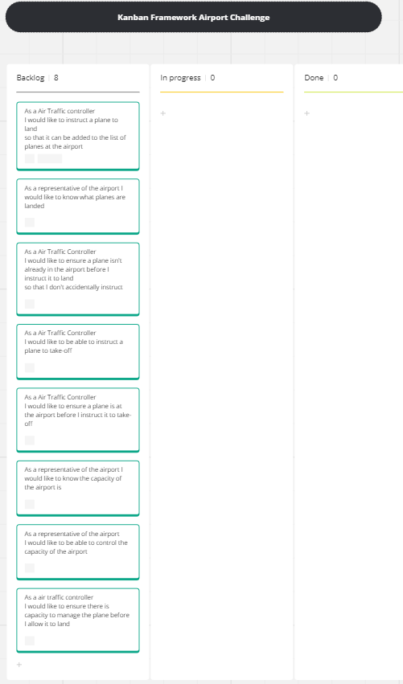
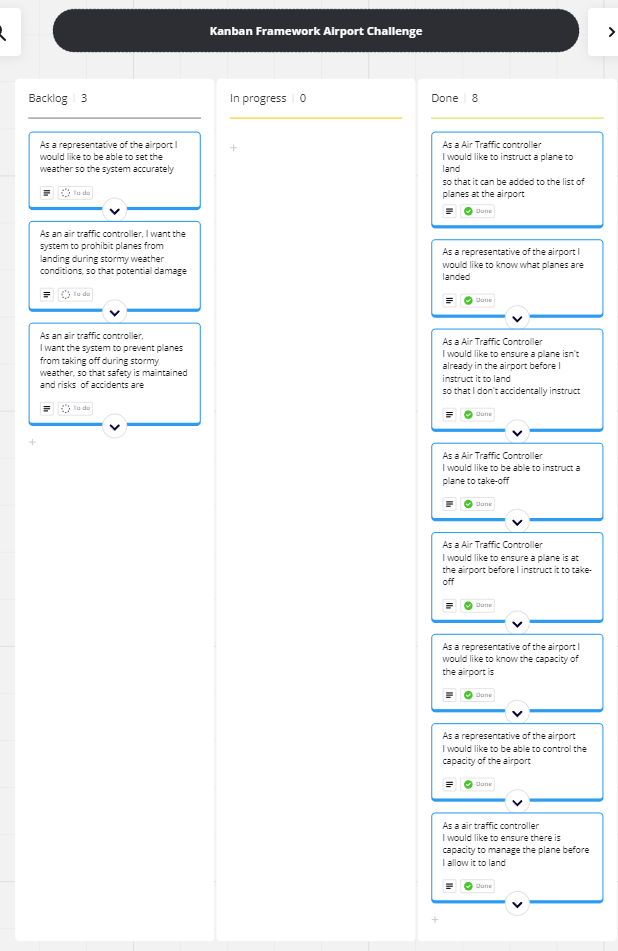

# Domain Models and Test Plan 

# Core Features

## Kanban board 

Miroboard view link: https://miro.com/app/board/uXjVKSeC0os=/?share_link_id=923411461171

## Domain Models

### <b><i>User Story 1</i></b>
 As a Air Traffic controller I would like to instruct a plane to land so that it can be added to the list of planes at the airport

 <b><i>Model</i></b>
| Objects    | Properties     | Messages    | Output  |
| ---------- | -------------- | ----------- | ------- |
| plane      | - acReg @String | - getReg() | @String | 
| airport     | - landedAircraft @Array[@plane] | - ~~addPlane(@plane)~~   - land(@plane) | @String |
 <b><i>Tests: </i></b>

- [x] A plane can be added to the list
- [x] something other than a plane returns an error message
- [x] null returns an error code

### <b><i>User Story 2</i></b>
 As a representative of the airport I would like to know what planes are landed
so that I know what planes are at the airport
 <b><i>Model</i></b>
| Objects    | Properties     | Messages    | Output  |
| ---------- | -------------- | ----------- | ------- |
| plane      | - acReg @String | - getReg() | @String | 
| airport     | - landedAircraft @Array[@plane] | - listPlanes() | @Array[@plane] |

 <b><i>Tests: </i></b>

- [x] lists the planes in the landed list

### <b><i>User Story 3</i></b>
 As a Air Traffic Controller I would like to ensure a plane isn't already in the airport before I instruct it to land so that I don't accidentally instruct an already landed plane to land again.
 <b><i>Model</i></b>
| Objects    | Properties     | Messages    | Output  |
| ---------- | -------------- | ----------- | ------- |
| plane      | - acReg @String | - getReg() | @String | 
| airport     | - landedAircraft @Array[@plane] | -  ~~addPlane(@plane)~~   - land(@plane)| @String |

 <b><i>Tests: </i></b>

- [x] Unable to add a plane which is already landed, with appropriate error message

### <b><i>User Story 4</i></b>
 As a Air Traffic Controller I would like to be able to instruct a plane to take-off so that it can be removed from the list of planes at the airport
 <b><i>Model</i></b>
| Objects    | Properties     | Messages    | Output  |
| ---------- | -------------- | ----------- | ------- |
| plane      | - acReg @String | - getReg() | @String | 
| airport     | - landedAircraft @Array[@plane] | - ~~remPlane(@plane)~~  - takeOff(@plane) | @String |

 <b><i>Tests: </i></b>

- [x] plane is removed from list
- [x] ~~if the plane isn't on the list, no plane is removed~~ related to User story 5.
- [x] able to handle a null plane appropriately
- [x] able to handle a erroneous data appropriately
  
  ### <b><i>User Story 5</i></b>
 As a Air Traffic Controller I would like to ensure a plane is at the airport before I instruct it to take-off so that I don't accidentally instruct a plane not at the airport to leave it.
 <b><i>Model</i></b>
| Objects    | Properties     | Messages    | Output  |
| ---------- | -------------- | ----------- | ------- |
| plane      | - acReg @String | - getReg() | @String | 
| airport     | - landedAircraft @Array[@plane] | - ~~remPlane(@plane)~~  - takeOff(@plane) | @String |

 <b><i>Tests:</i></b>

- [x] returns correct error code if no plane exists in the list to take off

  ### <b><i>User Story 6</i></b>
 As a representative of the airport I would like to know the capacity of the airport is so that I know how much space is available
 <b><i>Model</i></b>
| Objects    | Properties     | Messages    | Output  |
| ---------- | -------------- | ----------- | ------- |
| airport     | - landedAircraft @Array[@plane]   - maxCap @int | - landedCount()   - getMaxCap()  | @int |

 <b><i>Tests:</i></b>

- [x] returns correct amount of planes in list
- [x] able to return the maximum capacity of the airport 

  ### <b><i>User Story 7</i></b>
 As a representative of the airport I would like to be able to control the capacity of the airport so that we don't have more planes landed then we can manage
 <b><i>Model</i></b>
| Objects    | Properties     | Messages    | Output  |
| ---------- | -------------- | ----------- | ------- |
 
| airport     | - maxCap | - changeCap(@int) | @String |

 <b><i>Tests:</i></b>

- [x] correctly changes the capacity of the airport
- [x] responds with the correct error code if abnormal data (letters) detected
- [x] responds with the correct error code if abnormal data (0 or less) detected
- [x] responds with the correct error code if null data detected

### <b><i>User Story 8</i></b>
 As a air traffic controller I would like to ensure there is capacity to manage the plane before I allow it to land so that I don't land planes we can't manage.
 <b><i>Model</i></b>
| Objects    | Properties     | Messages    | Output  |
| ---------- | -------------- | ----------- | ------- |
| plane      | - acReg @String | - getReg() | @String | 
| airport     | - landedAircraft @Array[@plane] | -  ~~addPlane(@plane)~~   - land(@plane) | @String |

 <b><i>Tests:</i></b>

- [x] returns error message if attempting to land planes when capacity is full
- [x] allows planes to be landed at 1 less than capacity
- [x] won't allow the plane to land at full capacity, but then will allow plane to be landed if the capacity is increased 

# Additional Features

## Kandan Board

## Domain Models
### <b><i>User Story 9</i></b>
 As a representative of the airport I would like to be able to set the weather so the system accurately reports to the controllers if a plane can land or not.

 <b><i>Model</i></b>
| Objects    | Properties     | Messages    | Output  |
| ---------- | -------------- | ----------- | ------- |
| airport     | - weather @string | -  setWeather(@string)   - getWeather() | @String |

 <b><i>Tests:</i></b>

- [x] returns the value of weather
- [x] allows user to set weather a
- [x] confirm changing the value will report back the correct weather
- [x] confirm passing in a null value to setWeather is handled correctly
- [x] confirm passing in an empty string to setWeather is handled correctly

### <b><i>User Story 10</i></b>
 As an air traffic controller, I want the system to prohibit planes from landing during stormy weather conditions, so that potential damage to aircraft and infrastructure is avoided.

 <b><i>Model</i></b>
| Objects    | Properties     | Messages    | Output  |
| ---------- | -------------- | ----------- | ------- |
| plane      | | | |
| airport     | - stormy(@boolean)   -  landedAircraft @Array[@plane] | -  land(@plane) | @String |

 <b><i>Tests:</i></b>

- [x] if the weather is stormy the land function returns appropriate error message
- [x] if the weather is no longer stormy and no other exception is met, the plane can land

### <b><i>User Story 11</i></b>
 As an air traffic controller, I want the system to prevent planes from taking off during stormy weather, so that safety is maintained and risks of accidents are minimized.

 <b><i>Model</i></b>
| Objects    | Properties     | Messages    | Output  |
| ---------- | -------------- | ----------- | ------- |
| plane      | | | |
| airport     | - stormy(@boolean)   -  landedAircraft @Array[@plane] | -  takeOff(@plane) | @String |

 <b><i>Tests:</i></b>

- [ ] if the weather is stormy the takeOff function returns appropriate error message
- [ ] if the weather is not stormy and no other exception is met, the plane can take-off